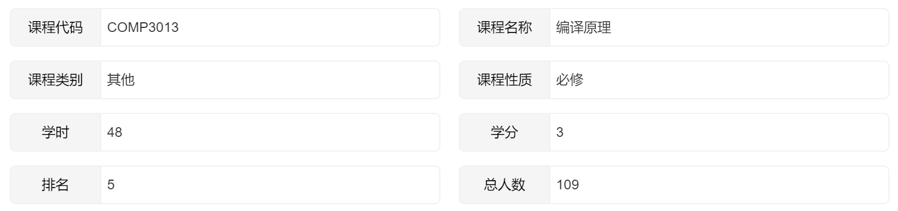
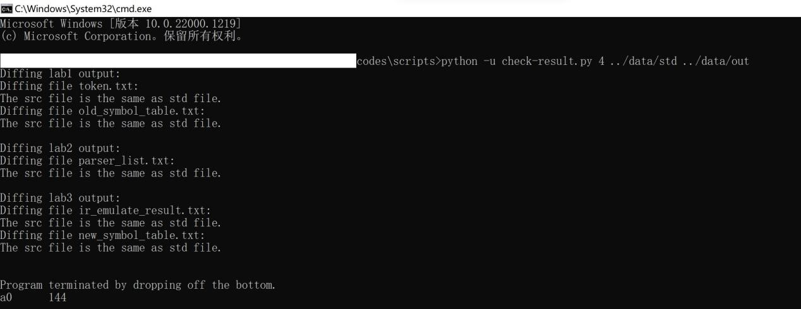

# 2022_HITSZ_Compiler-Labs

目标平台为 RISC-V 32 的 TXT 语言编译器

哈尔滨工业大学（深圳）2022年秋季学期《编译原理》课程实验

## 项目介绍

### 背景简介

该实验要求学生综合运用编译知识，在所给模板代码的基础上进行迭代开发，实现一个支持 TXT 语言的编译器。该实验要求所实现的编译器至少能正确处理以下代码片段：

```
int result;
int a;
int b;
int c;
a = 8;
b = 5;
c = 3 - a;
result = a * b - ( 3 + b ) * ( c - a );
return result;
```

其中，词法分析、语法分析、语义分析阶段的实际输出需要与标准输出进行比对，以确保各阶段的实现是正确的，而最终编译产生的汇编代码则需要在 RARS 上运行并得到正确结果。

- [实验报告](./report.pdf)

实验成绩的评定主要依据编译器的输出是否与标准输出一致，以及实验报告的撰写情况。作者实验部分的成绩最终为**100分（满分100分）**，总成绩为**98分（排名5/109）**。



### 四次实验内容安排

| 序号 | 实验名称               | 实验内容                                                     |
| ---- | ---------------------- | ------------------------------------------------------------ |
| 1    | 词法分析               | 根据读入的源语言的代码文本，生成词法单元迭代器并正确地将源语言中的每个标识符插入到符号表中。不要求记录每个词法单元的行号、起始列号、结束列号，不要求处理注释。 |
| 2    | 语法分析               | 实现一个通用的 LR 语法分析驱动程序。它可以读入词法单元类别、任意的语法以及与之匹配的任意的 LR 分析表，随后读入词法单元流，依次根据分析表与语法执行移入、规约、接受、报错动作，并在前三种动作执行时调用注册到其上的观察者的对应方法。 |
| 3    | 语义分析及中间代码生成 | 完成 SDT 风格的语义分析与 IR 生成。这两个过程作为观察者被注册到语法分析器中，其特定方法在语法分析执行特定动作时被调用，同时获得动作的相关信息。在语义分析中，需要在遇到每次声明的时候，于符号表中记录每个标识符的类型信息。在 IR 生成中，需要在遇到不同语法产生式时执行不同动作，产生 IR 指令列表。 |
| 4    | 汇编生成               | 完成汇编代码生成与寄存器分配。                               |

### 实验环境

- IntelliJ IDEA 2021.3.3 (Ultimate Edition)
- Java 17 及以上版本
- RARS

## 根目录下主要文件说明

- code
  - data
    - in：提供给编译器的输入数据
    - out：编译器运行后的实际输出
    - std：用作参考的标准输出数据
  - scripts
    - check-result.py：对输出进行 check 的脚本
    - diff.py：忽略文件尾空行和行首位空白符的 diff 工具
    - make-template.py：从代码出框架的脚本，无需关注
  - src：源码目录
- report.pdf：实验报告
- template.zip：模板代码

## 效果展示



